# 🎓 Esprit Alumni 

Welcome to **Esprit Alumni**! Embrace the power of networking within the Esprit community through our cutting-edge social networking app, meticulously built with Flutter, Node.js, and Python. Dive into a world of infinite opportunities to connect, learn, grow, and thrive together! 🌟

<p align="center">
 
</p>

## 🌟 Features

- 🛡️ **Secure Authentication**: Safeguard your data with our robust login and sign-up system.
<p align="center">
 
  
   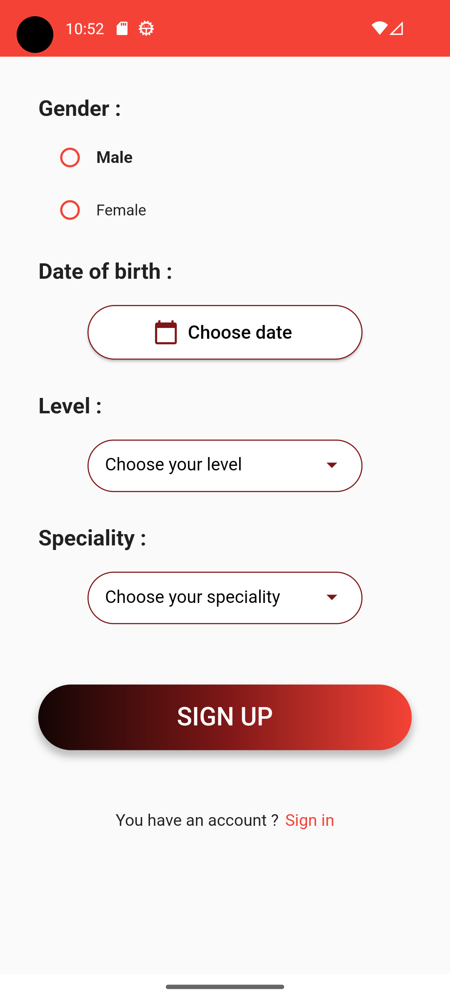
    
     
      
</p>

- 💬 **Chat**: Establish meaningful connections with Esprit students and alumni in real-time.
<p align="center">
 
  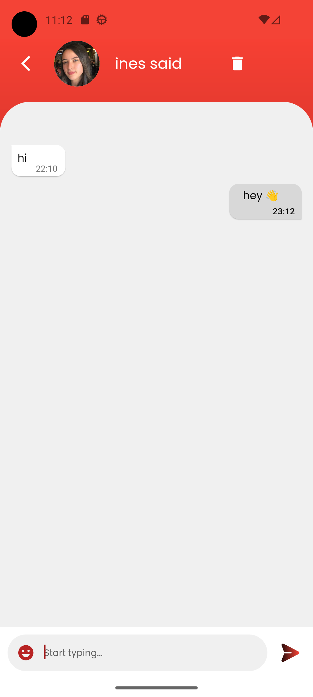
</p>

- 📝 **Posts**: Share your valuable thoughts, experiences, ideas, job openings, and internships with our thriving community.
<p align="center">
 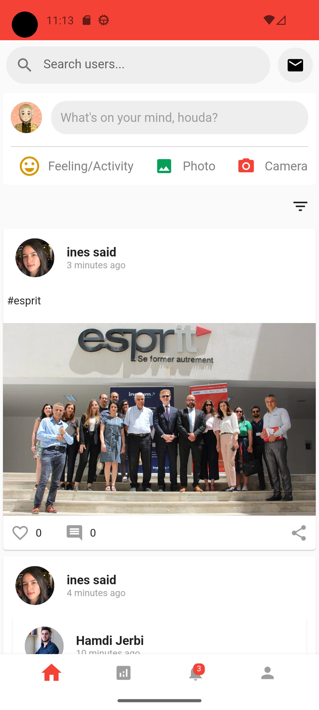
  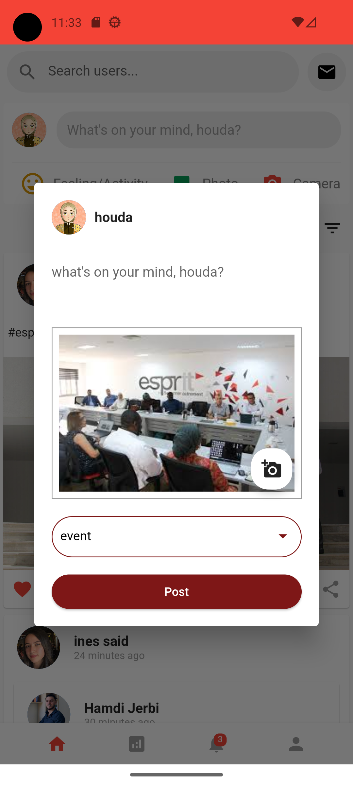
</p>

- 👍 **Liking and Commenting**: Engage, interact, and create lasting bonds by liking and commenting on posts.

<p align="center">
 
  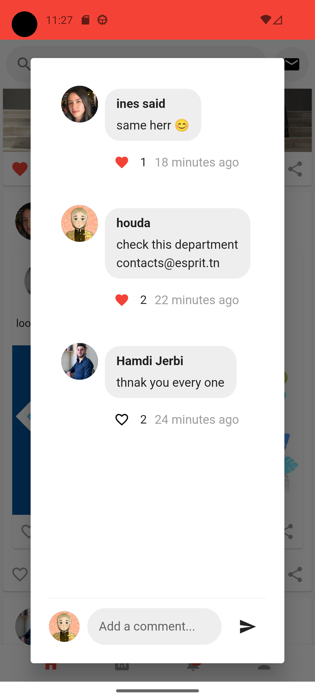
   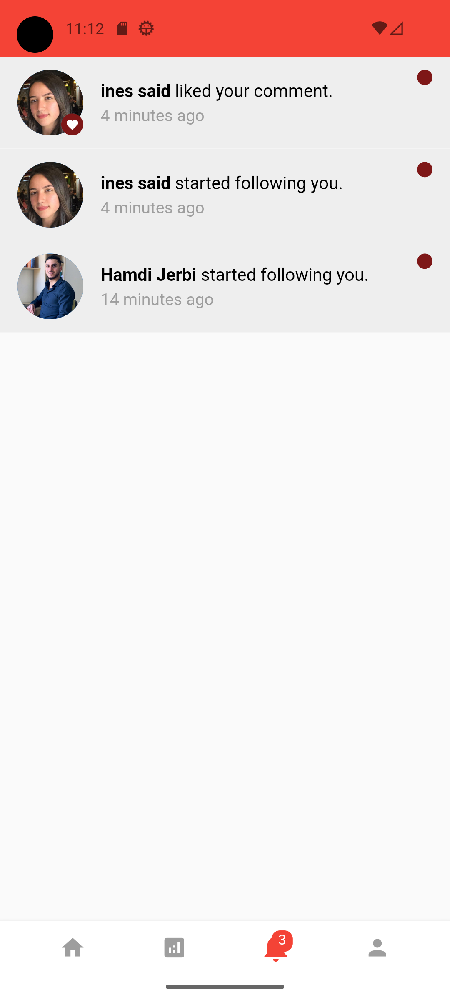
</p>

- 👥 **Following**: Stay in the loop with the latest updates from your favorite alumni and classmates.
<p align="center">
 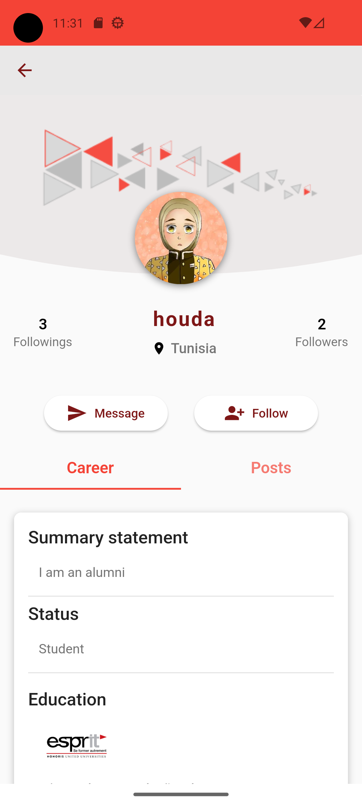
  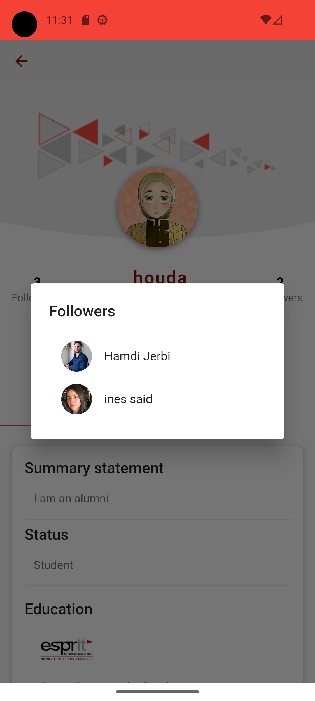
</p>

- 📇 **Profile Management**: Showcase your unique skills and experiences, and let your personality shine!

<p align="center">
 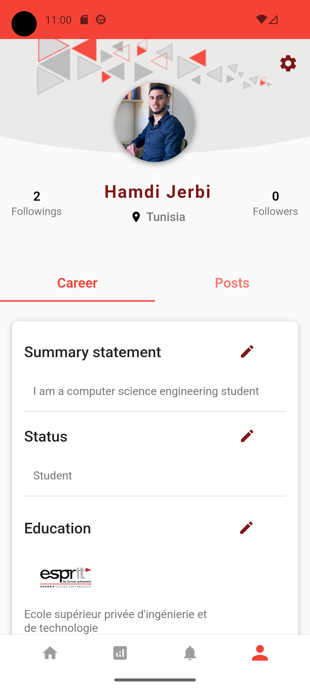
  
</p>


- 📊 **Statistics**: Delve into powerful insights on Esprit Alumni with our geographical distribution, in-demand field analysis, and popular fields within the Esprit community.

<p align="center">
 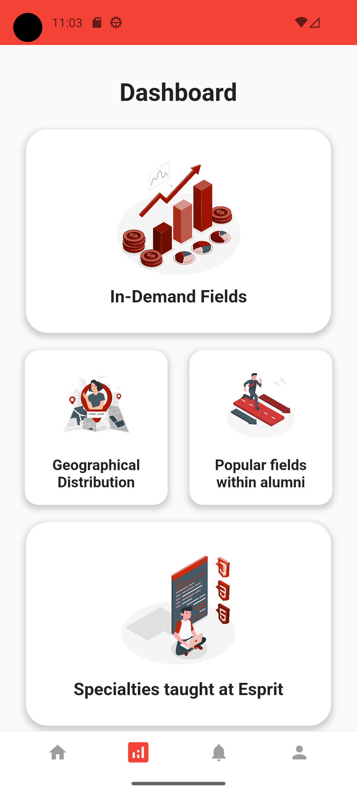
</p>

### 🌍 Geographical Distribution

Explore the global presence of Esprit Alumni with our interactive map, fueled by data scraped from LinkedIn.

<p align="center">
 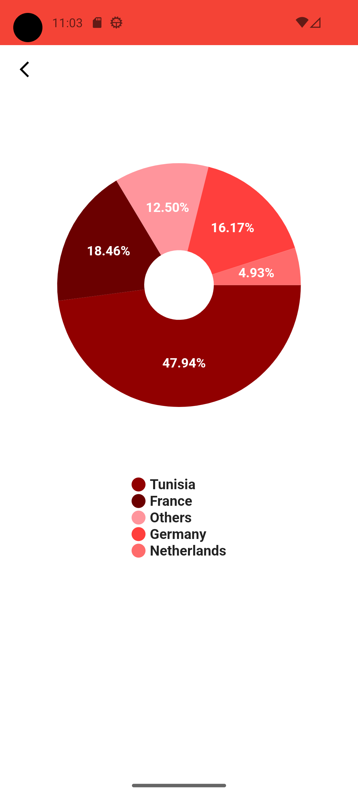
</p>

### 📈 In-demand Fields

Stay ahead of the curve by uncovering the most sought-after fields across various countries, including Tunisia, Germany, the Netherlands, and more.

<p align="center">
 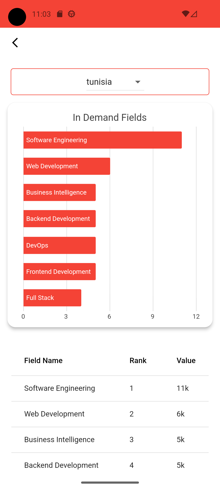
</p>

### 🔥 Popular Fields among Esprit Students

Esprit is renowned for its exceptional engineering education. Discover the popular fields where Esprit students excel, such as web development and other engineering disciplines.

<p align="center">
 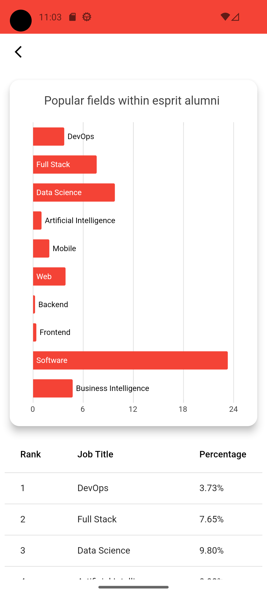
</p>

## 📊 Web Dashboard

We've also built an intuitive web dashboard, exclusively for Esprit admins. This powerful tool provides admins with a bird's eye view of the application's userbase, engagement, and other key metrics.

<p align="center">
 
  
   
    
</p>

## 🖥️ System Requirements

To run Esprit Alumni on your machine, make sure you have the following software installed:

- Flutter `latest version`
- Docker 

## 🚀 Getting Started

Embark on your **Esprit Alumni** journey with these easy steps:

1. Clone the GitHub repository:
```
https://github.com/Houdalar/Esprit-Alumni-frontend.git
```
2. Get the Flutter dependencies:
```
cd esprit-alumni
flutter pub get
```
3. Run the application:
```
flutter run
```
## 🐳 Docker Guide

Easily set up the backend, including MongoDB, using our Docker image, available on Docker Hub.

1. Install Docker on your machine: https://docs.docker.com/get-docker/

2. Pull the Esprit Alumni backend image from Docker Hub:
```
docker pull Houdalar/esprit-alumni-backend:latest
```
3. Run the Docker container:
```
docker run -d -p 8081:8081 --name esprit-alumni-backend Houdalar/esprit-alumni-backend:latest
```

Now, the backend and MongoDB should be up and running on port 8080.

## 🤝 Contributing

We treasure contributions from the Esprit community! Here's how you can make a difference:

1. Fork the repository.
2. Create a new branch with your amazing feature or bugfix.
3. Commit your changes.
4. Create a pull request and await a review.

## 📃 License

This project is licensed under the MIT License - see the [LICENSE](LICENSE) file for details.

## 🙌 Join the Esprit Alumni Community!

We can't wait for you to join the Esprit Alumni community! Dive in today by cloning the repository and unlock the endless possibilities of networking, recruiting, and collaborating with fellow Esprit students and alumni. Together, let's create a vibrant and supportive space to help each other succeed!
